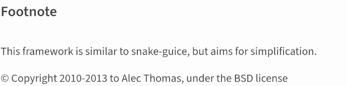

# Microservices architecture overview

---

# Microservices architecture overview

- Easy clone and go

---

# Microservices architecture overview

- Easy clone and go

#
    !bash
        git clone --recursive git@github.com:user/project.git
        cd project

---

# Microservices architecture overview

- Easy clone and go

#
    !bash
        git clone --recursive git@github.com:user/project.git
        cd project
        pip install -e ./[dev]

---

# Microservices architecture overview

- Easy clone and go

#
    !bash
        git clone --recursive git@github.com:user/project.git
        cd project
        pip install -e ./[dev]

- entrypoints

---

# Microservices architecture overview

- Easy clone and go

#
    !bash
        git clone --recursive git@github.com:user/project.git
        cd project
        pip install -e ./[dev]

- entrypoints
- pinned dependencies

---

# Microservices architecture overview

- Easy clone and go

#
    !bash
        git clone --recursive git@github.com:user/project.git
        cd project
        pip install -e ./[dev]

- entrypoints
- pinned dependencies
- ability to use with another project

---

# Microservices architecture overview

- Easy clone and go

#
    !bash
        git clone --recursive git@github.com:user/project.git
        cd project
        pip install -e ./[dev]

- entrypoints
- pinned dependencies
- ability to use with another project
- custom installation options `./[dev]`, `./[test]`, etc.

---

# Microservices architecture overview

- Easy clone and go

#
    !bash
        git clone --recursive git@github.com:user/project.git
        cd project
        pip install -e ./[dev]
        pytest

---

# Microservices architecture overview

- Easy clone and go
- Single entrypoint that **you** control

---

# Microservices architecture overview

- Easy clone and go
- Single entrypoint that **you** control
    - framework vs library

---

# Microservices architecture overview

- Easy clone and go
- Single entrypoint that **you** control
    - framework vs library
        - framework

---

# Microservices architecture overview

- Easy clone and go
- Single entrypoint that **you** control
    - framework vs library
        - framework
            - `flask --app hello run`

---

# Microservices architecture overview

- Easy clone and go
- Single entrypoint that **you** control
    - framework vs library
        - framework
            - `flask --app hello run`
            - `uvicorn example:app`

---

# Microservices architecture overview

- Easy clone and go
- Single entrypoint that **you** control
    - framework vs library
        - framework
            - `flask --app hello run`
            - `uvicorn example:app`
        - library

---

# Microservices architecture overview

- Easy clone and go
- Single entrypoint that **you** control
    - framework vs library
        - framework
            - `flask --app hello run`
            - `uvicorn example:app`
        - library
            - `python -m project`

---

# Microservices architecture overview

- Easy clone and go
- Single entrypoint that **you** control
- Configuration ways

---

# Microservices architecture overview

- Easy clone and go
- Single entrypoint that **you** control
- Configuration ways
    - click

---

# Microservices architecture overview

- Easy clone and go
- Single entrypoint that **you** control
- Configuration ways
    - click
        - validation

---

# Microservices architecture overview

- Easy clone and go
- Single entrypoint that **you** control
- Configuration ways
    - click
        - validation
        - environment variables

---

# Microservices architecture overview

- Easy clone and go
- Single entrypoint that **you** control
- Configuration ways
    - click
        - validation
        - environment variables
        - documentation (`python -m project --help`)

---

# Microservices architecture overview

- Easy clone and go
- Single entrypoint that **you** control
- Configuration ways
    - click
    - configuration file

---

# Microservices architecture overview

- Easy clone and go
- Single entrypoint that **you** control
- Configuration ways
    - click
    - configuration file
    - consul(?)

---

# Import/Run time prelude

---

# Import/Run time prelude

- Import time

---

# Import/Run time prelude

- Import time

#

    !python
        x = 1 / 0

---

# Import/Run time prelude

- Import time

#

    !python
        x = 1 / 0

`ZeroDivisionError: division by zero`

---

# Import/Run time prelude

- Import time
- Runtime

---

# Import/Run time prelude

- Import time
- Runtime

#

    !python
        def foo():
            x = 1 / 0

---

# Import/Run time prelude

- Import time
- Runtime

#

    !python
        def foo():
            x = 1 / 0
        print(dis(foo))

#

          0 LOAD_CONST               1 (1)
          2 LOAD_CONST               2 (0)
          4 BINARY_TRUE_DIVIDE
          6 STORE_FAST               0 (x)
          8 LOAD_CONST               0 (None)
         10 RETURN_VALUE

---

# Import/Run time prelude

Configuration resolved in runtime

---

# Import/Run time prelude

Configuration resolved in runtime

- Simpler mocking

---

# Import/Run time prelude

Configuration resolved in runtime

- Simpler mocking
- Another project can use your project as library

---

# Import/Run time prelude (summary)

---

# Import/Run time prelude (summary)

- Do not use import time configuration

---

# Import/Run time prelude (summary)

- Do not use import time configuration
- Import time constants are ok, but should be moved to configuration some day

---

# Back to microservices!

---

# Microservices architecture overview

- Easy clone and go
- Configuration ways

---

# Microservices architecture overview

- Easy clone and go
- Configuration ways
    - cock!

---

# Microservices architecture overview

- Easy clone and go
- Configuration ways
    - cock

#
    !python
        from cock import build_entrypoint, Config, Option

        def main(config: Config):
            print(config)

        options = [
            Option("a_b_c", default="foo"),
            Option("b_c_d", default="bar"),
        ]
        entrypoint = build_entrypoint(
            main, options,
            auto_envvar_prefix="PROJECT",
            show_default=True,
        )

        if __name__ == "__main__":
            entrypoint(prog_name="project")

---

# Microservices architecture overview

- Easy clone and go
- Configuration ways
    - cock

#
    !bash
        $ python project.py --help
        Usage: project [OPTIONS] [CONFIGURATION_FILE]

        Options:
        --a-b-c TEXT  [default: foo]
        --b-c-d TEXT  [default: bar]
        --help        Show this message and exit.
---

# Microservices architecture overview

- Easy clone and go
- Configuration ways
    - cock

#
    !python
        from cock import build_entrypoint, Config, Option
        from project.db import db_options
        from project.web_server import web_server_options

        def main(config: Config):
            print(config)

        options = [
            *db_options,
            *web_server_options,
        ]
        ...

---

# Microservices architecture overview

- Easy clone and go
- Configuration ways
- Dependency injection

---

# Microservices architecture overview

- Easy clone and go
- Configuration ways
- Dependency injection

https://pypi.org/project/injector/

---

# Microservices architecture overview

- Easy clone and go
- Configuration ways
- Dependency injection

https://pypi.org/project/injector/

---

# Microservices architecture overview

- Easy clone and go
- Configuration ways
- Dependency injection

https://pypi.org/project/injector/

---

# Microservices architecture overview

- Easy clone and go
- Configuration ways
- Dependency injection

---

# Microservices architecture overview

- Easy clone and go
- Configuration ways
- Dependency injection

#
    !python

    # a.py
    class Foo:
        def __init__(a: int, b: str):
            ...

    # b.py
    from a import Foo
    class Main:
        def __init__(self, a: int, b: str):
            self.foo = Foo(a, b)
            ...

---

# Microservices architecture overview

- Easy clone and go
- Configuration ways
- Dependency injection

#
    !python

    # a.py
    class Foo:
        def __init__(a: int, b: str):
            ...

    @register(name="foo")
    def create_foo(a: int, b: str) -> Foo:
        return Foo(a, b)

    # b.py
    from a import Foo
    class Main:
        @inject
        def __init__(self, foo: Foo):
            self.foo = foo
            ...

---

# Microservices architecture overview

- Easy clone and go
- Configuration ways
- Dependency injection

#
    !python

    # a.py
    class Foo:
        def __init__(a: int, b: str):
            ...

    @register(name="foo", singleton=True)
    def create_foo(a: int, b: str) -> Foo:
        return Foo(a, b)

    # b.py
    from a import Foo
    class Main:
        @inject
        def __init__(self, foo: Foo):
            self.foo = foo
            ...

---

# Microservices architecture overview

- Easy clone and go
- Configuration ways
- Dependency injection

https://pypi.org/project/giveme/

---

# Microservices architecture overview

- Easy clone and go
- Configuration ways
- Dependency injection

https://pypi.org/project/giveme/

---

# Microservices architecture overview

- Easy clone and go
- Configuration ways
- Dependency injection

#
    !python

        # injector.py
        from giveme import Injector

        __all__ = (
            "injector",
            "inject",
            "register",
        )

        injector = Injector()
        inject = injector.inject
        register = injector.register

---

# Microservices architecture overview

- Easy clone and go
- Configuration ways
- Dependency injection

#
    !python

    # web_server.py
    class WebServer:
        def __init__(host: str, port: int):
            ...

    @register(name="web_server", singleton=True)
    @inject
    def web_server_from_config(config: Config) -> WebServer:
        return WebServer(
            host=config.web_server_host,
            port=config.web_server_port,
        )

    # main_service.py
    from web_server import WebServer
    class MainService:
        @inject
        def __init__(self, web_server: WebServer):
            self.web_server = web_server

---

# Microservices architecture overview

- Easy clone and go
- Configuration ways
- Dependency injection
    - giveme

---

# Microservices architecture overview

- Easy clone and go
- Configuration ways
- Dependency injection
    - giveme
        - register by name

---

# Microservices architecture overview

- Easy clone and go
- Configuration ways
- Dependency injection
    - giveme
        - register by name
        - 95% singleton

---

# Microservices architecture overview

- Easy clone and go
- Configuration ways
- Dependency injection
    - giveme
        - register by name
        - 95% singleton
        - inject

---

# Microservices architecture overview

- Easy clone and go
- Configuration ways
- Dependency injection
    - giveme
        - register by name
        - 95% singleton
        - inject
    - pytest

---

# Microservices architecture overview

- Easy clone and go
- Configuration ways
- Dependency injection
    - giveme
        - register by name
        - 95% singleton
        - inject
    - pytest
        - fixtures

---

# Microservices architecture overview

- Easy clone and go
- Configuration ways
- Dependency injection
- Service management

---

# Microservices architecture overview

- Easy clone and go
- Configuration ways
- Dependency injection
- Services management inside microservice

---

# Microservices architecture overview

- Easy clone and go
- Configuration ways
- Dependency injection
- Services management inside microservice
    - `PostgresService`, `RedisService`, `WebServerService`, `MainService`

---

# Microservices architecture overview

- Easy clone and go
- Configuration ways
- Dependency injection
- Services management inside microservice
    - `PostgresService`, `RedisService`, `WebServerService`, `MainService`
    - API

---

# Microservices architecture overview

- Easy clone and go
- Configuration ways
- Dependency injection
- Services management inside microservice
    - `PostgresService`, `RedisService`, `WebServerService`, `MainService`
    - API
    - `__init__` method for configuration and dependencies collection

---

# Microservices architecture overview

- Easy clone and go
- Configuration ways
- Dependency injection
- Services management inside microservice
    - `PostgresService`, `RedisService`, `WebServerService`, `MainService`
    - API
    - `__init__` method for configuration and dependencies collection
    - `start` method for starting services

---

# Microservices architecture overview

- Easy clone and go
- Configuration ways
- Dependency injection
- Services management inside microservice
    - `PostgresService`, `RedisService`, `WebServerService`, `MainService`
    - API
    - `__init__` method for configuration and dependencies collection
    - `start` method for starting services
    - `stop` method for stopping services

---

# Microservices architecture overview

- Easy clone and go
- Configuration ways
- Dependency injection
- Services management inside microservice
    - `PostgresService`, `RedisService`, `WebServerService`, `MainService`
    - API
    - `__init__` method for configuration and dependencies collection
    - `start` method for starting services
    - `stop` method for stopping services
    - `dependencies` to start and stop services in correct order

---

# Microservices architecture overview

- Easy clone and go
- Configuration ways
- Dependency injection
- Services management inside microservice
    - `PostgresService`, `RedisService`, `WebServerService`, `MainService`
    - API
    - `__init__` method for configuration and dependencies collection
    - `start` method for starting services
    - `stop` method for stopping services
    - `dependencies` to start and stop services in correct order
    - `async`/`await` for async services

---

# Microservices architecture overview

- Easy clone and go
- Configuration ways
- Dependency injection
- Services management inside microservice

https://pypi.org/project/mode/

---

# Microservices architecture overview

- Easy clone and go
- Configuration ways
- Dependency injection
- Services management inside microservice

https://pypi.org/project/mode/

---

# Microservices architecture overview

- Easy clone and go
- Configuration ways
- Dependency injection
- Services management inside microservice

https://pypi.org/project/facet/ (138 loc + 191 loc tests)

---

# Microservices architecture overview

...

- Services management inside microservice

#
    !python
        from facet import ServiceMixin

        class MainService(ServiceMixin):
            def __init__(self, web_server: WebServerService,
                         postgres: PostgresService, redis: RedisService):
                self.web_server = web_server
                self.postgres = postgres
                self.redis = redis

            @property
            def dependencies(self):
                return [
                    [self.postgres, self.redis],
                    self.web_server,
                ]

            async def start(self):
                ...

            async def stop(self):
                ...

---

# Microservices architecture overview

- https://pypi.org/project/yacore/
- https://github.com/pohmelie/cookiecutter-yacore

---

# Questions?
